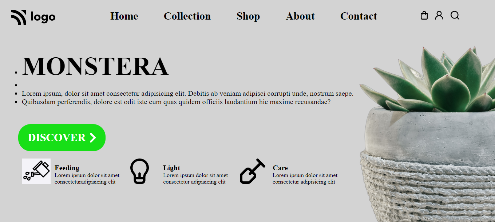

# Project 1 - HTML  and CSS 

> 
>
> By Naga Rajasekhar

You can find the live deployment link of this web page here --> **[#](#)**
 
 
 
 

 

### Learnings from completing this project

1. Gained knowledge about postions and its properties 
2. Learnt about z-index
3. Gained knowledge about padding, margin, colors, border and their values
